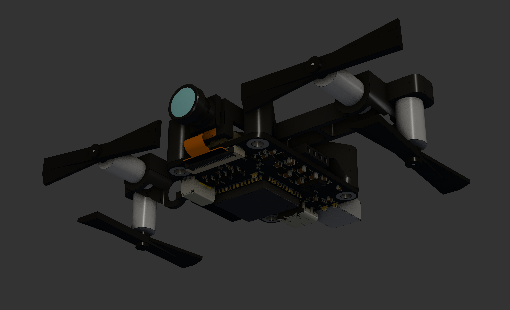
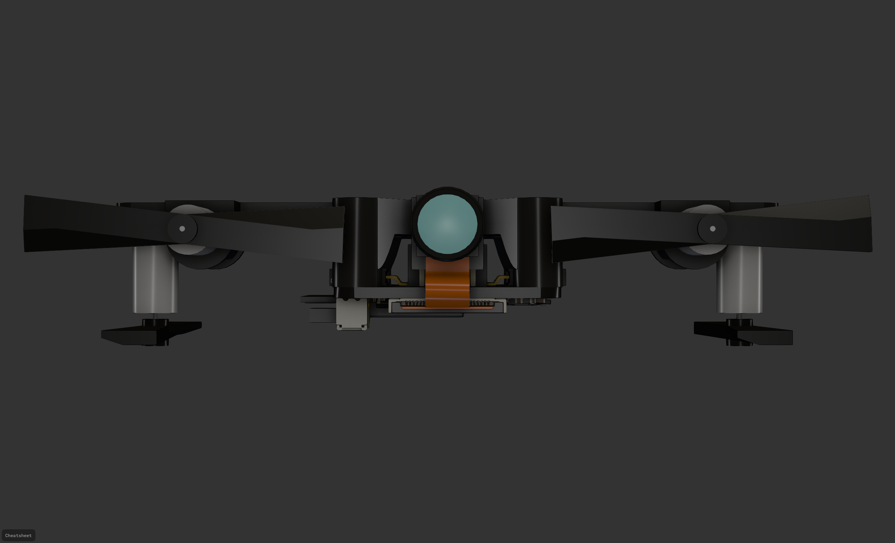

# Falcon Core

<table>
  <tr>
    <td></td>
    <td></td>
  </tr>
</table>

A custom standalone ESP32-S3 flight controller for an indoor autonomous blimp. Successor to [Falcon Flight](https://github.com/PHS-SMCS/falcon-flight), redesigned from a Raspberry Pi Zero 2W HAT into a purpose-built 32×46mm 4-layer PCB.

Sponsored by [PCBWay](https://www.pcbway.com/).

## Specifications

- **MCU:** ESP32-S3-WROOM-1 (N8R8/N16R8) — dual-core LX7, Wi-Fi, BLE, 8MB PSRAM
- **Camera:** OV2640 via 24-pin 0.5mm FFC, 8-bit DVP interface
- **IMU:** BMI270 (6-axis accel/gyro, I2C)
- **Magnetometer:** MMC5633NJL (3-axis AMR, I2C, 1.62–3.6V)
- **ToF Sensor:** VL53L5CX (I2C)
- **Motor Drivers:** 4× DRV8212P bidirectional H-bridge
- **Battery Sensing:** Internal ADC (GPIO7)
- **Status LED:** Programmable red LED (GPIO48)
- **Board:** 32×46mm, 4-layer, matte black solder mask
- **Weight:** ~11.5–13g (excluding battery and camera module)

## Power

- **Battery:** BetaFPV 3.7V 300mAh 1S LiPo
- **Charging:** TP4057 via USB-C (5.1kΩ CC pull-downs)
- **Motor Power:** Direct battery feed to DRV8212P VM pins
- **Logic Isolation:** BLM18PG221SN1D ferrite bead between battery and logic rail
- **Regulators (ME6211 LDOs, SOT-23-5):**
  - 3.3V — ESP32-S3, sensors, VDDIO
  - 2.8V × 2 — OV2640 AVDD and DOVDD
  - 1.2V — OV2640 DVDD

## GPIO Assignment

| GPIO | Function |
|------|----------|
| 1, 2 | SCCB (camera I2C — SIOD, SIOC) |
| 3 | M2_IN1 |
| 4 | M3_IN2 |
| 5 | M3_IN1 |
| 6 | M1_IN2 |
| 7 | BAT_ADC (battery voltage sensing) |
| 8, 18 | Main I2C bus (SDA, SCL) |
| 9, 10, 11, 12, 13, 14, 21, 40 | OV2640 DVP data bus (D8, D7, D6, D2, D5, D3, D4, D9) |
| 15 | M4_IN1 |
| 16 | M4_IN2 |
| 17 | M1_IN1 |
| 19, 20 | USB D−/D+ |
| 38 | Camera PCLK |
| 39 | Camera XCLK |
| 41 | HREF |
| 42 | VSYNC |
| 43, 44 | UART0 debug |
| 47 | M2_IN2 |
| 48 | Red LED (1kΩ to GND) |

Camera PWDN tied to GND, RESETB tied to 3.3V.

## I2C Bus

All sensors share the main I2C bus (GPIO8/18):

- BMI270 (accel/gyro)
- MMC5633NJL (magnetometer)
- VL53L5CX (time-of-flight)

Camera SCCB runs on a separate bus (GPIO1/2).

## Motor Layout

- 2× horizontal forward-facing motors (thrust)
- 1× downward-facing altitude motor (mounted below PCB on standoff)
- 1× TBD

## Firmware

Built with ESP-IDF. Custom PID stabilization (no ArduPilot). Communicates with a laptop over WebSocket for optical flow and AprilTag detection via OpenCV.

## License

See [LICENSE](LICENSE).